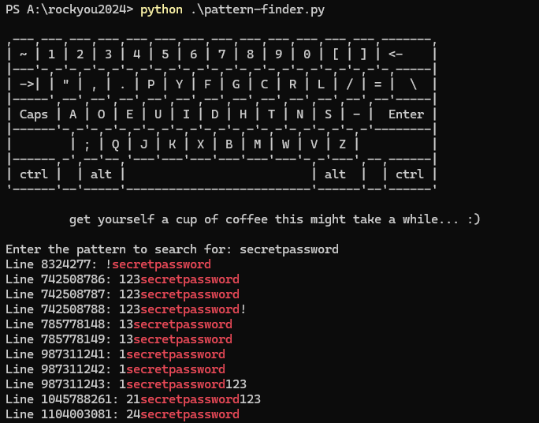

# Search-pattern-in-large-files

Recently the password list rockyou2024.txt was published, which is 150 GB in size. For this reason I have written a short Python script. The script reads the file line by line to minimize memory usage and highlights the found pattern in red. It outputs each line containing the pattern along with its line number, making it easier to identify and analyze relevant lines.

# Magnet Link Rockyou2024

magnet:?xt=urn:btih:4e3915a8ecf6bc174687533d93975b1ff0bde38a

# How to use? 

python3 pattern-finder.py

Enter pattern to search for: 

